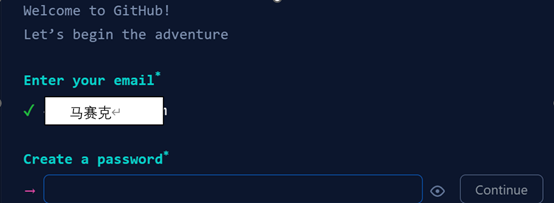
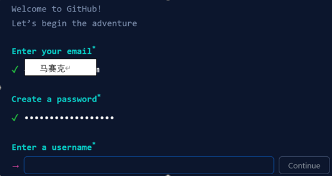
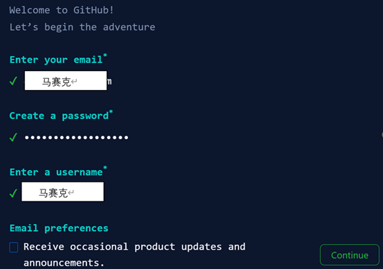
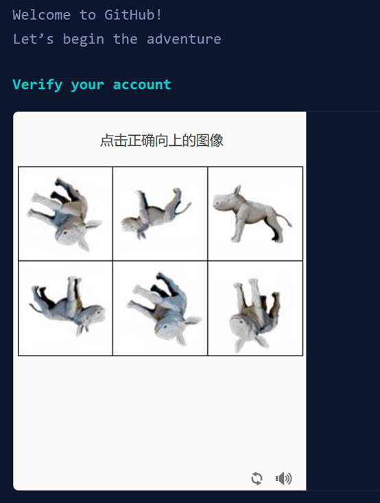
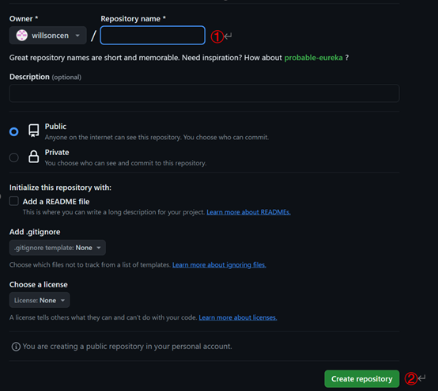
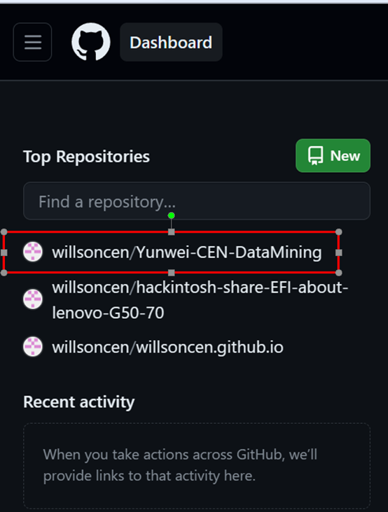
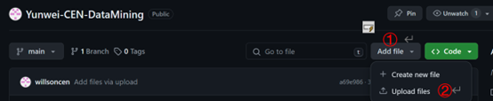

# Yunwei-CEN-DataMining 操作指南

## 一、注册GitHub账号

### 前期准备
- **邮箱**: 准备一个能正常接收邮件的邮箱。

### 具体步骤
1. **访问GitHub**: 打开浏览器，输入 `github.com` 并访问。
2. **注册**: 点击页面右上角的 `Sign up` 按钮。
[图片1]（https://github.com/willsoncen/Yunwei-CEN-DataMining/blob/main/image/%E5%9B%BE%E7%89%871.png）
3. **输入邮箱**: 在弹出的窗口中输入你的邮箱地址，核对格式无误后点击 `Continue`。

4. **设置密码**: 输入你想要设置的密码，完成后点击 `Continue`。

5. **选择用户名**: 输入你想要的GitHub用户名，完成后点击 `Continue`。

6. **邮箱偏好设置**: （可选）调整邮件通知偏好，然后点击 `Continue`。

7. **验证账户**: 根据页面提示完成人机验证。

8. **邮箱验证**: 查收邮箱中的GitHub验证邮件，并根据邮件指引完成验证步骤。

## 二、创建项目（以 `Yunwei-CEN-DataMining`为例）

1. **登录**: 登录你的GitHub账户，返回GitHub首页。
2. **新建仓库**: 点击右上角的加号图标，然后选择 `New repository`。

3. **命名仓库**: 输入项目名称 `Yunwei-CEN-DataMining`，中间的仓库属性可选。

4. **创建**: 完成仓库信息填写后，点击 `Create repository`。

## 三、上传PPT至项目

1. **返回主页**: 登录GitHub后，回到GitHub首页，在左侧导航栏可以看到先前创建的 `Yunwei-CEN-DataMining` 项目。

2. **选择项目**: 点击进入 `Yunwei-CEN-DataMining` 项目页面。
3. **添加文件**: 在页面顶部导航栏，点击 `Add file`，然后选择 `Upload files`，浏览并上传你的PPT文件。

4. **提交**: 填写提交信息，点击 `Commit changes` 完成上传。

## 四、想学习的计算机技能
1. **熟练掌握至少一种编程语言**：如Python，这些语言能够实现复杂的算法和高效的数据处理任务。
2. **支持向量机（SVM）**：学习支持向量机的工作机制及其数学基础，在模式识别和分类任务中有效应用SVM，特别是在确保车辆轨迹安全无碰撞方面。
3. **蒙特卡洛树搜索（MCTS）**：深入理解MCTS的搜索策略和决策过程，利用其作为启发式搜索算法，在动态和不确定性环境中寻找最优决策序列，适合自动驾驶等领域的决策制定。
4. **模型预测控制（MPC）**：掌握MPC的核心概念，了解其在预测未来状态并据此做出控制决策的机制，学会如何在车辆运动精确规划与控制场景中应用MPC，以达到高度动态和精确的控制目标。
